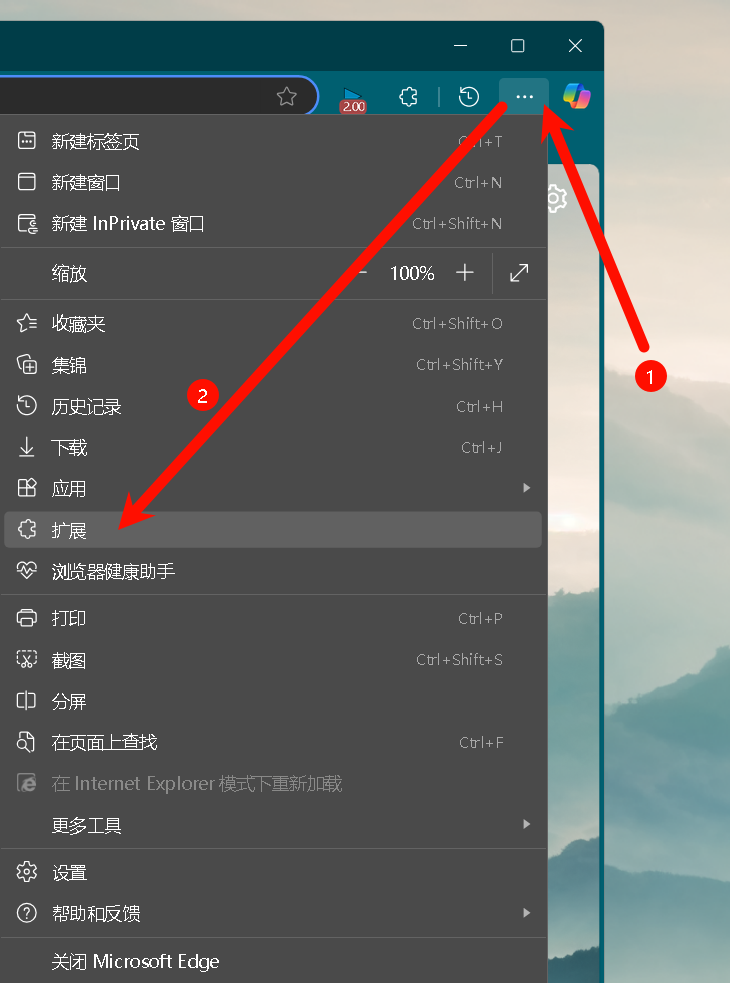
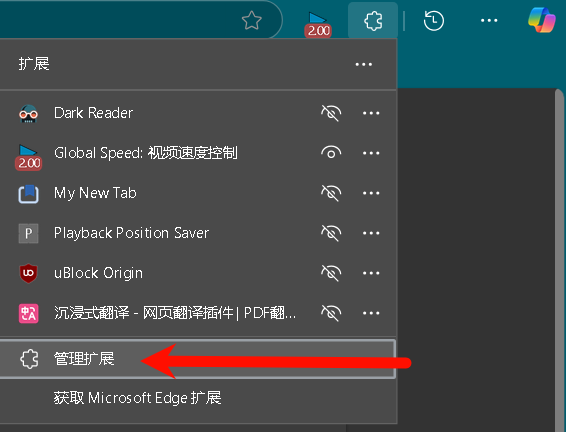
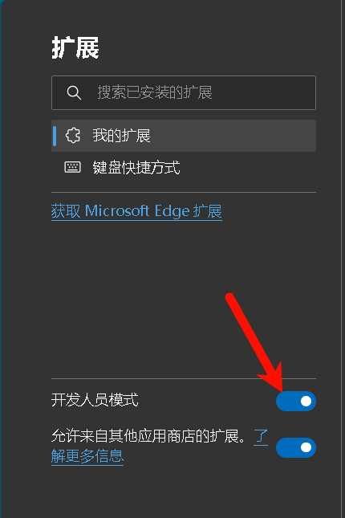
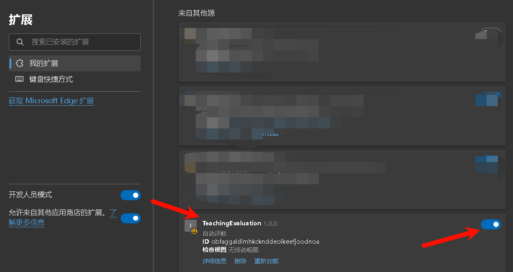
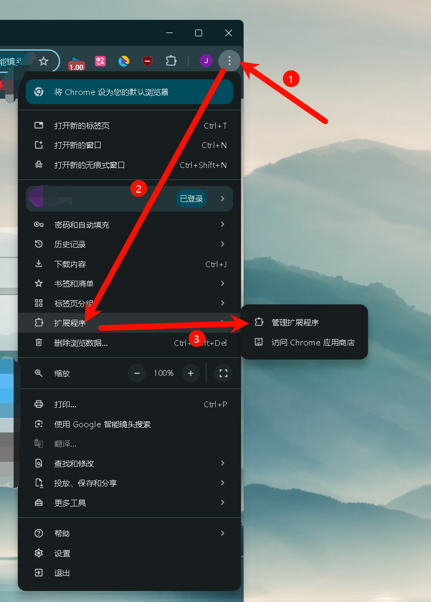
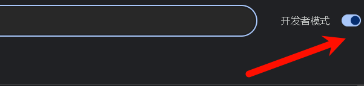
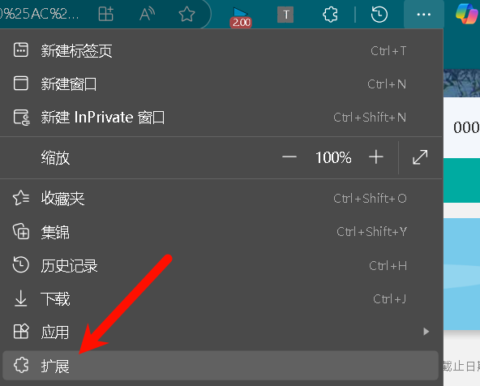
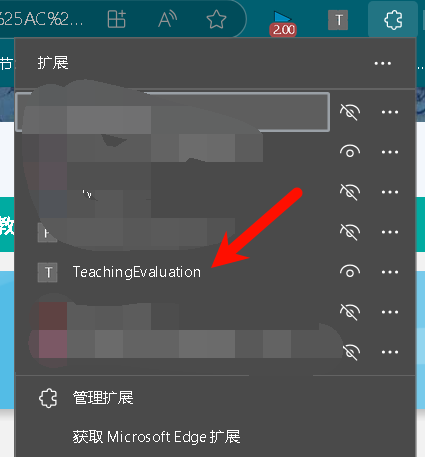
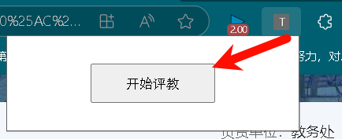

# TeachingEvaluation

有什么问题可以加我QQ：3428884780

## 功能
自动完成兰州大学评教

## 用法
1. 下载
   1. 点击右侧 “Release” 下方的 x.x.x 进入对应版本
   2. 点击 “TeachingEvaluation.zip” 即可下载
   3. 解压下载好的 “TeachingEvaluation.zip” 
   4. 注意！请使得打开 “TeachingEvaluation” 文件夹后可以直接看到很多文件，而不是里面依然有一个 “TeachingEvaluation” 文件夹，如果里面还有一个文件夹，请先重命名外层的文件夹，然后把内层文件夹移动到外层，再把之前的外层文件夹删掉，保证打开 “TeachingEvaluation” 文件夹后可以直接看到很多文件
2. 安装
   1. 如果是在edge中使用然后将 “TeachingEvaluation” 文件夹拖动到页面里，完成后如下图：
   2. 如果是在chrome中使用之后的步骤与edge类似
3. 使用
    1. 打开 “兰州大学个人工作台” 页面，在页面上方搜索栏中搜索 “听评课” 点击进入
    2. 选择某一学期的评教任务，打开
    3. 然后等待即可